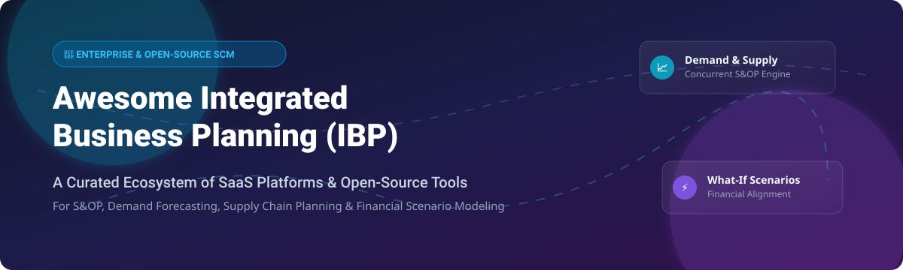
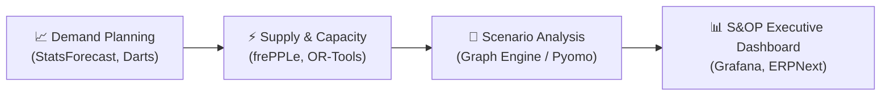

# 📊 Awesome Integrated Business Planning (IBP)

     

**A Curated List of Enterprise SaaS Platforms & Open-Source GitHub Projects for Integrated Business Planning (IBP), Sales & Operations Planning (S&OP), Demand Forecasting & Supply Chain Optimization.**

---

## 🎯 Overview & Key Concepts

**Integrated Business Planning (IBP)** extends traditional **Sales & Operations Planning (S&OP)** by seamlessly connecting demand planning, supply chain execution, inventory optimization, and financial forecasting into a single transparent workflow. 

This repository serves as an authoritative guide for operations executives, supply chain strategists, data scientists, and engineers evaluating commercial **SaaS solutions** and **open-source planning technologies**.

---

## 📑 Table of Contents

- [🌐 Sector Market Overview](#-sector-market-overview)
- [💼 SaaS & Hosted IBP Platforms](#-saas--hosted-ibp-platforms)
- [💻 Open-Source GitHub Projects](#-open-source-github-projects)
- [🛠️ Architecture & Best Practices](#%EF%B8%8F-architecture--best-practices)
- [🤝 How to Contribute](#-how-to-contribute)
- [📜 Disclaimer](#-disclaimer)
- [☕ Support & Community](#-support--community)
- [📈 Star History](#-star-history)

---

## 🌐 Sector Market Overview

**Market Size & Sector Structure**: The global Integrated Business Planning (IBP) and Supply Chain Management (SCM) software market is estimated at **$24.5 Billion in 2026** and is projected to reach **$45.8 Billion by 2032** (growing at a CAGR of ~11.2%). The sector is **moderately concentrated**, dominated by enterprise ERP/SCM suites (Oracle, SAP, Blue Yonder, Anaplan, Kinaxis) holding significant market share, alongside fast-growing specialized retail and mid-market planning platforms.

---

## 💼 SaaS & Hosted IBP Platforms

The following commercial SaaS solutions lead the enterprise market in concurrent planning, scenario simulation, and financial integration. *Platforms are sorted below by company size (Revenue / Valuation) in descending order.*

| Platform / Product | Company Size (Revenue / Valuation) | Starting Price | Free Tier / Trial Limit | Key Focus & Core Capabilities |
| :--- | :--- | :--- | :--- | :--- |
| **[Oracle IBP / Cloud SCM](https://www.oracle.com/)** | ~$53.0B Revenue ($380.0B Valuation) | $150 / user / month | 30-Day Oracle Cloud Free Tier ($300 credits & 2 DBs) | Deep Oracle Cloud ERP integration, multi-site demand & supply planning. |
| **[SAP Integrated Business Planning (IBP)](https://www.sap.com/products/scm/integrated-business-planning.html)** | ~$34.5B Revenue ($250.0B Valuation) | $250 / user / month ($100k/yr base) | 14-Day SAP Cloud Guided Sandbox (5 session limit) | S/4HANA native integration, inventory optimization, S&OP control tower. |
| **[Blue Yonder (Luminate)](https://blueyonder.com/)** | ~$1.1B Revenue ($8.5B Valuation) | $75,000 / year base tier | 30-Day Proof-of-Concept (POC) Enterprise Sandbox | Luminate platform, cognitive supply chain, retail & manufacturing planning. |
| **[Anaplan](https://www.anaplan.com/)** | ~$1.0B Revenue ($10.7B Valuation) | $50,000 / year ($150 / user / month) | 30-Day Guided Enterprise Sandbox (90-day academic) | Hyperblock engine, connected financial & operational scenario planning. |
| **[Kinaxis (Maestro)](https://www.kinaxis.com/)** | ~$440M Revenue ($3.2B Valuation) | CA$30,000 / year (~$22,000/yr entry) | 30-Day Customized Enterprise POC Sandbox | Concurrent planning engine, rapid end-to-end what-if scenario modeling. |
| **[RELEX Solutions](https://www.relexsolutions.com/)** | ~$250M Revenue ($5.7B Valuation) | $40,000 / year base platform | 30-Day Pilot Validation Sandbox for Retail Networks | Consumer demand forecasting, automated replenishment & retail planning. |
| **[OMP Unison Planning](https://www.omp.com/)** | ~$200M Revenue (~$1.5B Valuation) | $60,000 / year base license | 30-Day Structured Pilot Evaluation Program | Solves complex constraint-based manufacturing and continuous process planning. |
| **[Logility](https://www.logility.com/)** | ~$105M Revenue ($400M Valuation) | $35,000 / year base subscription | 14-Day Interactive Guided Demo Sandbox | AI-driven supply chain planning, demand management & inventory allocation. |
| **[ToolsGroup](https://www.toolsgroup.com/)** | ~$75M Revenue (~$300M Valuation) | $25,000 / year base license | 30-Day Data Evaluation & ROI POC Trial | Probabilistic demand forecasting, service-level driven inventory optimization. |
| **[John Galt Solutions (Atlas)](https://johngalt.com/)** | ~$50M Revenue (~$200M Valuation) | $20,000 / year base subscription | 14-Day Interactive Sandbox / Guided Pilot | Atlas Planning Platform for mid-market and enterprise demand & supply planning. |

---

## 💻 Open-Source GitHub Projects

While enterprise-wide IBP suites are commercial, production-ready open-source engines, solvers, and modules power custom demand forecasting, MRP, inventory optimization, and supply chain building blocks. *Repositories are sorted by GitHub star count in descending order.*

1. **[frappe/erpnext](https://github.com/frappe/erpnext)**   
   Full-featured open-source ERP suite providing MRP, production scheduling, bill of materials (BOM), work orders, and supply planning capabilities.

2. **[facebook/prophet](https://github.com/facebook/prophet)**   
   Automatic forecasting procedure for time-series data with robust handling of trend shifts, seasonality, and holiday effects in demand planning.

3. **[google/or-tools](https://github.com/google/or-tools)**   
   Google's open-source software suite for linear programming, integer programming, constraint modeling, and network distribution optimization.

4. **[statsmodels/statsmodels](https://github.com/statsmodels/statsmodels)**   
   Python module providing classes and functions for statistical estimation, time-series analysis (ARIMA, VAR, state space), and econometric modeling.

5. **[unit8co/darts](https://github.com/unit8co/darts)**   
   Python library for user-friendly forecasting and time series processing, seamlessly combining classical statistical models and deep learning (TFT, N-BEATS).

6. **[inventree/InvenTree](https://github.com/inventree/InvenTree)**   
   Open-source inventory management system offering stock control, part tracking, BOM management, and purchasing coordination.

7. **[Nixtla/statsforecast](https://github.com/Nixtla/statsforecast)**   
   Lightning-fast statistical time series forecasting algorithms (AutoARIMA, AutoETS) optimized for high-volume enterprise SKU demand forecasting pipelines.

8. **[Pyomo/pyomo](https://github.com/Pyomo/pyomo)**   
   Python-based open modeling framework for formulating mathematical optimization problems for complex supply networks and production planning.

9. **[coin-or/pulp](https://github.com/coin-or/pulp)**   
   High-level linear programming modeler written in Python that interfaces with solvers like CBC and GLPK to solve inventory and capacity constraints.

10. **[TimefoldAI/timefold-solver](https://github.com/TimefoldAI/timefold-solver)**   
    Open-source AI planning solver (fork of OptaPlanner) for complex vehicle routing, shift scheduling, and multi-stage production optimization.

11. **[frePPLe/frepple](https://github.com/frePPLe/frepple)**   
    Open-source demand forecasting, inventory optimization, and Advanced Planning & Scheduling (APS) tool tailored for manufacturing companies.

12. **[ngoineau/ootils-core](https://github.com/ngoineau/ootils-core)**   
    Graph-based supply chain decision engine supporting propagation, shortage detection, MRP-style explosion, and scenario simulation.

---

## 🛠️ Architecture & Best Practices

When combining open-source building blocks for custom enterprise IBP:
1. **Demand Layer**: Ingest point-of-sale and order history data into `StatsForecast` or `Darts` to generate statistical SKU-level demand forecasts.
2. **Supply & Capacity Layer**: Pass consensus forecasts to `frePPLe` or `OR-Tools` to evaluate plant capacity, BOM constraints, and lead times.
3. **Scenario Layer**: Run what-if simulations across revenue, margin, and working capital trade-offs in Python/Jupyter environments.
4. **Executive Alignment**: Feed final planning metrics into open BI tools (`Metabase`, `Grafana`) or ERP systems (`ERPNext`) for S&OP review meetings.

---

## 🤝 How to Contribute

Contributions are welcome! To add or update an enterprise platform or open-source tool:

1. Fork this repository.
2. Add your entry to `README.md` keeping formatting consistent.
3. Ensure links are active, accurate, and non-promotional.
4. Submit a Pull Request describing your addition.

---

## 📜 Disclaimer

This repository is community-curated for research and informational purposes. Planning platforms involve significant financial and operational commitments. Ensure models and tools are independently audited before operational deployment.

---

## ☕ Support & Community

Thank you for exploring **Awesome Integrated Business Planning**! If this curated list helps your supply chain strategy, S&OP research, or engineering projects, please consider supporting the repository:

- ⭐ **Star this repository** to increase visibility and help others discover it.
- 🔀 **Fork and share** with your network, team, or colleagues.
- 💡 **Open a Pull Request** to submit new enterprise solutions or open-source tools.
- 💖 **Sponsor the Maintainer**: Support ongoing curation via the [GitHub Sponsor Dashboard](https://github.com/sponsors/ishandutta2007).

---

## 📈 Star History

